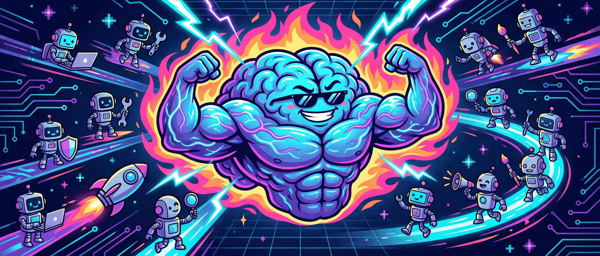

<p align="center">
  
</p>

<p align="center">
  
  
  
  
  
</p>

<h1 align="center">Lumantis - MegaBrain</h1>

<p align="center">
  <strong>One prompt. Full orchestration. Zero intervention.</strong>
</p>

<p align="center">
  Generate complete, autonomous, self-healing multi-agent orchestrations<br>
  from a single natural language prompt.
</p>

---

## What is this?

**MegaBrain** is a Claude Code plugin that transforms any project idea into a fully executable, multi-agent orchestration pipeline. You describe what you want to build, and MegaBrain creates a permanent skill that runs the entire project autonomously from start to finish.

```
You:    /new-orchestration "Build a SaaS task manager with auth, dashboard, and Stripe billing"

Claude: Orchestration created: /lumantis-saas-task-manager
        Phases: 12 | Agents: 34 | Pattern: dag-pipeline | Complexity: large

You:    /lumantis-saas-task-manager

Claude: [runs autonomously to completion...]
        Phase 1/12 complete - Project scaffolded
        Phase 4/12 complete - API endpoints built, 47 tests passing
        Phase 8/12 complete - Frontend integrated, visual validation passed
        Phase 12/12 complete - Deployed. All 94 tests green.
        COMPLETE - Final report below.
```

## Key Features

| Feature | Description |
|---------|-------------|
| **170+ Specialized Agents** | From Frontend Developer to Security Engineer to TikTok Strategist |
| **5 Orchestration Patterns** | Sequential, Parallel Fan-Out, DAG Pipeline, Loop-Iterate, Hybrid |
| **100% Autonomous** | Zero questions during execution. All decisions made automatically |
| **Self-Healing** | Tiered retry: same agent, alt approach, different agent, decompose |
| **Auto-Dream Memory** | 4-phase memory consolidation after every orchestration |
| **Learning Loops** | Instinct capture, agent performance tracking, meta-improvement |
| **Resume & Recovery** | Interrupted? Resume exactly where you left off |
| **Visual Checkpoints** | Screenshots via Claude Preview for UI validation |
| **Scalable to 50+ agents** | Mega projects decompose into sub-orchestrations |

## Quick Start

### Install (Drag & Drop)

1. Open **Claude Code** desktop app (Windows/Mac)
2. Drag `Lumantis-MegaBrain` folder into the app window
3. Done. Type `/new-orchestration` to start.

### Your first orchestration

```
/new-orchestration "Create a portfolio website with dark mode, blog, and contact form"
```

MegaBrain will:
1. **Analyze** your prompt (intent, tech stack, complexity)
2. **Design** the optimal DAG with the right agents
3. **Generate** a permanent `/lumantis-portfolio-site` skill
4. **Review** it adversarially for completeness
5. **Deploy** it to your skills directory

Then run it:
```
/lumantis-portfolio-site
```

Sit back. It runs to completion autonomously.

## How It Works

```
Your Prompt
    |
    v
[DECODE] -----> Intent Map (domains, complexity, tech stack)
    |
    v
[ARCHITECT] --> DAG Blueprint + Agent Roster + Quality Gates
    |
    v
[COMPOSE] ----> Complete /lumantis-* skill file
    |
    v
[REVIEW] -----> Adversarial verification (fix loop if needed)
    |
    v
[DEPLOY] -----> Installed in ~/.claude/skills/ and ready to use
```

## Examples

| Prompt | Generated Skill | Agents Used |
|--------|----------------|-------------|
| "Build a SaaS with auth and billing" | `/lumantis-saas-auth-billing` | Software Architect, Backend Architect, Frontend Dev, Security Engineer, DevOps... |
| "Marketing campaign for my app launch" | `/lumantis-marketing-launch` | Content Creator, SEO Specialist, Social Media Strategist, Growth Hacker... |
| "Security audit of my codebase" | `/lumantis-security-audit` | Security Engineer, Threat Detection, Code Reviewer, Compliance Auditor... |
| "Build a 2D platformer in Godot" | `/lumantis-godot-platformer` | Game Designer, Godot Gameplay Scripter, Level Designer, Game Audio... |
| "Research AI trends and write a report" | `/lumantis-ai-research` | Trend Researcher, AI Engineer, Technical Writer, Analytics Reporter... |

## Plugin Contents

```
Lumantis-MegaBrain/
  .claude-plugin/
    plugin.json                    # Plugin manifest
  skills/
    new-orchestration/
      SKILL.md                     # Core engine (5-phase pipeline)
      agent-catalog.md             # 170+ agents organized by domain
      orchestration-patterns.md    # 5 patterns + decision tree
      lumantis-template.md         # Template for generated skills
      embedded-methodologies.md    # Standalone: TDD, security, brainstorm...
  README.md                        # This file
```

## Requirements

- **Claude Code** desktop app (Windows or Mac) or CLI
- No other dependencies. Fully standalone.

## Compatibility

Works with all Claude Code plugins and MCP servers you have installed. MegaBrain detects and leverages:
- Claude Preview (visual validation)
- Chrome MCP (browser automation)
- Gmail/Calendar MCP (email/scheduling)
- Netlify MCP (deployment)
- HuggingFace MCP (AI/ML)
- Any other MCP servers

## License

MIT - Use freely, modify, share.

---

<p align="center">
  <sub>April 2026</sub>
</p>
