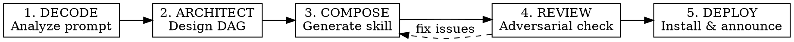

# /new-orchestration — Lumantis Orchestration Generator

Generate complete, autonomous, self-healing multi-agent orchestrations from a single prompt. The generated `/lumantis-*` skills run to completion with zero user intervention.

## Hard Rules

- **EVERY generated skill uses the `/lumantis-` prefix** — no exceptions
- **EVERY generated skill runs fully autonomously** — zero user questions during execution
- **EVERY generated skill includes learning loops** — captures instincts post-completion
- **EVERY generated skill includes auto-dream** — memory consolidation after execution
- **Read reference files ONLY when needed** — don't load agent-catalog.md until Phase 2

## Standalone Mode

This plugin is **fully standalone** — it works WITHOUT any external plugins installed.

**How it works:**
- `embedded-methodologies.md` contains all key patterns (TDD, brainstorming, security review, etc.)
- When generating `/lumantis-*` skills, check if external skills exist (e.g., `superpowers:tdd`)
- If they exist: reference them by name in the generated skill (saves tokens)
- If they DON'T exist: embed the methodology INLINE from `embedded-methodologies.md`
- The generated skill must ALWAYS be self-sufficient — never assume external plugins are present

**Embedded methodologies include:** Brainstorming, TDD, Verification, Security Review, Code Review,
Blueprint Planning, De-Sloppify, Adversarial Review, Context Bridging, Auto-Dream, Continuous Learning,
Deployment Patterns, Content Engine, API Design.

## Pipeline



## Phase 1: DECODE

Analyze the user's prompt to extract:

**Intent Map:**
- `intent`: build | fix | audit | research | market | design | content | data | game | sales | operate
- `domains[]`: engineering, marketing, security, design, data, devops, product, sales, game-dev, content, research
- `complexity`: trivial (1-2 tasks) | small (3-5) | medium (5-10) | large (10-20) | mega (20+)
- `tech_stack`: detected languages, frameworks, platforms
- `constraints`: deadlines, platforms, budget, compliance

**Skill Matching:**
Scan installed skills for matches. Key mappings:
- SaaS/app → `launch-saas`, `deployment-patterns`, `security-review`
- Marketing → `marketing-blitz`, `content-engine`, `crosspost`
- Game → `build-game` + engine-specific patterns
- Security → `security-fortress`, `security-review`, `security-scan`
- Data/AI → `data-intelligence`, `pytorch-patterns`, `huggingface-*`
- Content → `content-machine`, `article-writing`, `video-editing`
- Feature → `ship-feature`, `tdd-workflow`, `verification-loop`
- Startup → `startup-from-zero`, `investor-materials`, `market-research`
- Sales → `close-enterprise-deal`, sales agents

**MCP Server Detection:**
- Web research needed? → Chrome MCP, Exa search
- Visual validation? → Claude Preview MCP
- Email/calendar? → Gmail MCP, GCal MCP
- Deployment? → Netlify MCP
- AI/ML? → HuggingFace MCP

**Output:** Intent Map structure embedded in the generated skill.

## Phase 2: ARCHITECT

Read `agent-catalog.md` to select agents. Read `orchestration-patterns.md` to select pattern.

**Pattern Selection:**
| Complexity | Pattern | When |
|-----------|---------|------|
| trivial | `sequential` | 1-2 linear tasks |
| small | `parallel-fan-out` | 3-5 independent tasks |
| medium | `dag-pipeline` | 5-10 tasks with dependencies |
| large | `dag-pipeline` + `loop-iterate` | 10-20 tasks, review cycles |
| mega | `hybrid` | 20+ tasks, decompose into sub-orchestrations |

**Agent Selection Rules:**
1. Match domain tags from DECODE to agent catalog domains
2. Select 1 primary agent + 0-2 support agents per phase
3. Always include: Code Reviewer (for code phases), Reality Checker (for final gate)
4. For code: add language-specific reviewer (TypeScript, Python, Rust, Go, etc.)
5. Max agents per phase: 3 (primary + 2 parallel reviewers)
6. Total agents uncapped — mega projects can use 50+

**Model Routing per Phase:**
- Research/exploration → `haiku` (fast, cheap)
- Implementation → `sonnet` (balanced)
- Planning/architecture → `opus` (deep reasoning)
- Review/security audit → `opus` (critical judgment)
- Cleanup/formatting → `haiku` (mechanical)

**Quality Gate Tiers:**
| Tier | Gates |
|------|-------|
| trivial | implement → test |
| small | implement → test → code-review |
| medium | plan → implement → test → code-review + security-review → fix |
| large | research → plan → implement → test → code-review + security-review → fix → final-review |
| mega | Per sub-orchestration: full large pipeline |

**Output:** DAG Blueprint + Agent Roster + Gate definitions.

## Phase 3: COMPOSE

Generate the `/lumantis-<name>/SKILL.md` using `lumantis-template.md` as skeleton.

**Generated skill MUST include ALL of these sections:**

### 3.1 Frontmatter
```yaml
---
name: lumantis-<kebab-name>
description: Use when <specific triggering conditions>
generated_by: new-orchestration
generated_at: YYYY-MM-DD
complexity: <tier>
pattern: <pattern>
total_phases: <N>
total_agents: <N>
---
```

### 3.2 Autonomy Contract
```markdown
## Autonomy Contract
This orchestration runs FULLY AUTONOMOUSLY. Once launched:
- Zero questions to user during execution
- All decisions made by the Decision Engine
- All failures handled by Self-Healing Pipeline
- Progress notifications are non-blocking (no response expected)
- Only terminal states surface to user: SUCCESS or BLOCKED (after all retries exhausted)
```

### 3.3 DAG Flowchart
Graphviz `digraph` showing all phases, dependencies, fork/merge points, loop edges.

### 3.4 Phase Definitions
For EACH phase:
```markdown
### Phase N: <Name> [tier]
- **Agents**: subagent_type values to dispatch
- **Model**: haiku | sonnet | opus
- **Autonomy**: FULL_AUTO | AUTO_WITH_FALLBACK
- **Input**: Handoff from predecessor
- **Action**: Exact instructions for agents
- **Skills**: Existing skills to invoke (by name)
- **MCP**: Tools to use if applicable
- **Output**: Expected deliverable
- **Gate**: Pass condition (tests green, build passes, review approved)
- **On Fail**: Retry strategy (see Self-Healing)
```

### 3.5 Self-Healing Pipeline
```markdown
## Self-Healing Pipeline
Phase fails →
  Retry 1: Same agent + error context enrichment
  Retry 2: Same agent + alternative approach prompt
  Retry 3: Different agent from same domain
  Still fails + critical? → Decompose into smaller sub-tasks, retry each
  Still fails + non-critical? → Skip + log in final report
  All options exhausted → Save state + notify user "BLOCKED at Phase N"
```

### 3.6 Decision Engine
```markdown
## Decision Engine (Autonomous)
| Decision Point | Auto-Resolution |
|---------------|-----------------|
| Architecture choice A vs B | Planner agent decides per best practices + instincts |
| Test failure | Auto-fix with error context (max 3 retries) |
| Review rejection | Fix-agent with reviewer feedback, re-submit |
| Merge conflict | Agent with fewer files redoes its phase |
| Missing dependency | Auto-install + log in decisions.md |
| Ambiguity in prompt | Choose conventional option + document in decisions.md |
```

### 3.7 Memory System
```markdown
## Memory System

### Session Layer (TodoWrite)
- 1 todo per atomic action, prefix: [Phase N/Total]
- Exactly 1 in_progress at a time
- Mark completed IMMEDIATELY, never batch
- On failure: keep in_progress + add diagnostic todo

### Project Layer (Persistent)
Files in project memory directory:
- lumantis-<name>-state.md — Current phase, completed phases, blockers
- lumantis-<name>-decisions.md — All autonomous decisions with justification
- lumantis-<name>-context.md — Cumulative handoff context (cross-session bridge)

Read state on launch → detect resume point → continue or restart.
Write state after EVERY phase completion.

### Handoff Format (Between Phases)
## HANDOFF: Phase N → Phase N+1
### State: Completed N/Total, Current: Phase N+1
### Cumulative Context: [All decisions since Phase 1]
### Deliverables: [Files from Phase N]
### Instructions: [What Phase N+1 must do]
```

### 3.8 Auto-Dream Integration
```markdown
## Auto-Dream (Post-Completion Memory Consolidation)

After orchestration completes, run 4-phase dream cycle:

### ORIENT
- Read project MEMORY.md and all topic files
- Map what's already known about this project

### GATHER SIGNAL
- Scan session transcript for: decisions made, techniques used,
  agents that excelled/failed, retry patterns, skip reasons
- Extract high-value patterns (corrections, successes, blockers)

### CONSOLIDATE
- Merge findings into project memory topic files:
  - feedback_orchestration.md — What worked, what didn't
  - project_<name>_state.md — Final state and deliverables
  - agent_performance.md — Per-agent success/retry/fail rates
- Convert relative dates to absolute
- Delete contradicted entries
- Merge duplicates

### PRUNE & INDEX
- Update MEMORY.md index (stay under 200 lines)
- Remove entries >90 days old with no recent activity
- Record consolidation timestamp in .last-dream
```

### 3.9 Learning Loops
```markdown
## Learning Loops

### Intra-Execution Loops
- Review-Fix Loop: implement → review → pass? next : fix → re-review (max 3)
- De-Sloppify Pass: separate cleanup agent after all implementation phases
- Visual Validation: screenshot → show user (non-blocking) → adjust if needed (max 3)

### Post-Execution Learning
1. Retrospective: Planner agent analyzes workflow execution
2. Instinct Capture: learn-eval extracts reusable patterns
   - Low confidence (0.3) → confirmed 3x → Medium (0.6) → confirmed 5x → High (0.9)
3. Agent Performance: update agent-performance.md with per-agent metrics
4. Auto-Dream: run full 4-phase memory consolidation (Section 3.8)

### Meta-Learning (Improves /new-orchestration itself)
Next invocation reads:
- memory/agent-performance.md → adjust agent selection
- memory/feedback_orchestration.md → adjust pattern/gate choices
- instincts (via instinct-status) → apply high-confidence rules automatically
```

### 3.10 Progress Notifications (Non-Blocking)
```markdown
## Progress Notifications
Emit after each phase (text only, no questions):
[lumantis-<name>] Phase N/Total complete — <one-line summary> ✓
[lumantis-<name>] COMPLETE — Final report below.
```

### 3.11 Final Report
```markdown
## Final Report Template
### Result: SUCCESS | PARTIAL | BLOCKED
### Metrics: phases/total, agents dispatched, tests pass/fail, retries
### Deliverables: files created/modified
### Decisions: autonomous choices with justification
### Skipped Phases: if any, with reason
### Visual Proofs: screenshots from visual checkpoints
### Retrospective: auto-generated insights
### Next Steps: suggested follow-up actions
```

## Phase 4: REVIEW

Dispatch adversarial review subagent (model: opus, type: `everything-claude-code:planner`):

**Review Checklist:**
- [ ] All phases have defined agents, gates, and fail strategies
- [ ] DAG dependencies are acyclic and complete
- [ ] No phase requires user input (autonomy contract)
- [ ] Memory system covers all 3 layers
- [ ] Self-healing covers all failure modes
- [ ] Auto-dream section present and complete
- [ ] Learning loops reference correct skills
- [ ] Handoff format is consistent across phases
- [ ] TodoWrite integration specified
- [ ] Final report template included

**On Issues:** Fix inline → re-review (max 2 iterations).

## Phase 5: DEPLOY

1. Write generated skill to `~/.claude/skills/lumantis-<name>/SKILL.md`
2. If supporting files needed (large reference, scripts), add them
3. Verify: `ls ~/.claude/skills/lumantis-<name>/`
4. Save to project memory: `memory/project_lumantis_<name>.md` with creation date and description
5. Announce to user:

```
Orchestration created: /lumantis-<name>
- Phases: N | Agents: M | Pattern: <pattern> | Complexity: <tier>
- Run: just type /lumantis-<name>
- Fully autonomous — launches and runs to completion
- Memory + learning + auto-dream integrated
```

## Anti-Patterns

| Mistake | Fix |
|---------|-----|
| Loading agent-catalog.md in Phase 1 | Only load in Phase 2 when selecting agents |
| Asking user questions in generated skills | Generated skills are 100% autonomous |
| Generating a plan instead of a skill | Always generate a permanent SKILL.md file |
| Skipping auto-dream section | EVERY generated skill includes auto-dream |
| Hardcoding agent names without fallbacks | Always specify primary + fallback agent |
| Single retry strategy | Tiered: same agent → alt approach → diff agent → decompose |
| Flat todo list | Prefix with [Phase N/Total] for progress visibility |
