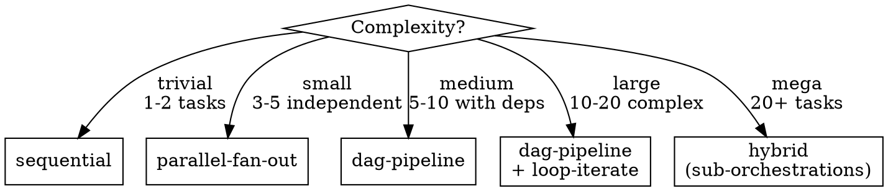

# Orchestration Patterns Reference

Reference file for Phase 2 (ARCHITECT). Only load when selecting pattern.

## Pattern Decision Tree



## 1. Sequential

```
Phase 1 → Phase 2 → Phase 3 → Done
```

**When:** Linear workflow, each phase depends on previous.
**Agents:** 1-3 per phase, executed in order.
**Loops:** Review-fix loop per phase if needed.
**Example:** Fix a bug (diagnose → fix → test → review).

## 2. Parallel Fan-Out

```
         ┌→ Agent A ─┐
Start ───┼→ Agent B ──┼→ Merge → Done
         └→ Agent C ─┘
```

**When:** Independent tasks, no shared state.
**Agents:** Up to 5 in parallel (Agent tool limit per message).
**Loops:** Each branch has own review loop. Merge resolves conflicts.
**Example:** Multi-domain audit (security + performance + accessibility in parallel).

## 3. DAG Pipeline

```
Phase 1 → Phase 2 ─┬→ Phase 3a ─┬→ Phase 5 → Phase 6
                    └→ Phase 3b ─┘
                         ↑
                    Phase 4 (parallel)
```

**When:** Complex dependencies, some parallelism possible.
**Agents:** Assigned per phase, max 3 per phase.
**Loops:** Review-fix per phase. Merge queue for converging branches.
**Gate tiers:**
- Trivial phases: implement → test
- Small: implement → test → review
- Medium: plan → implement → test → review + security → fix
- Large: research → plan → implement → test → dual-review → fix → final-review

**Key patterns from Ralphinho RFC Pipeline:**
- Separate context windows per stage (reviewer never wrote the code)
- Worktree isolation for parallel phases
- Merge queue with eviction/recovery on conflict
- Data flow: research → plan → implement → test → review → fix

## 4. Loop-Iterate

```
Implement → Review → Pass? → Next
                  ↓ Fail
              Fix → Re-Review (max 3)
```

**When:** Refinement cycles needed (TDD, review loops, visual iteration).
**Combined with:** dag-pipeline for large projects.
**Loop types:**
- **TDD loop:** Write test → implement → run test → pass? → next : fix → re-run
- **Review loop:** Submit → review → approved? → next : fix → re-submit (max 3)
- **Visual loop:** Render → screenshot → acceptable? → next : adjust → re-render (max 3)
- **De-sloppify:** All phases done → cleanup agent → final review

## 5. Hybrid (Mega Projects)

```
Sub-Orch 1 (dag-pipeline) → Sub-Orch 2 (dag-pipeline) → Sub-Orch 3
     ↑                            ↑
  Own DAG                      Own DAG
  Own agents                   Own agents
  Own loops                    Own loops
```

**When:** 20+ tasks. Decompose into 3-7 sub-orchestrations.
**Each sub-orchestration:** Full dag-pipeline with own agents, loops, gates.
**Coordination:** Sequential execution of sub-orchestrations. Each produces handoff for next.
**Memory:** Shared project memory across sub-orchestrations. Each reads predecessor state.

## Model Routing Table

| Phase Type | Model | Reasoning |
|-----------|-------|-----------|
| Research, exploration | haiku | Fast, cheap, broad scanning |
| Implementation, coding | sonnet | Balanced speed/quality |
| Planning, architecture | opus | Deep reasoning, complex design |
| Code review, security | opus | Critical judgment calls |
| Cleanup, formatting | haiku | Mechanical, deterministic |
| Test writing | sonnet | Balanced, follows patterns |
| Documentation | sonnet | Clear writing, consistent |

## Quality Gate Definitions

### Gate: BUILD_PASS
- Code compiles without errors
- No TypeScript/lint errors
- Dependencies install correctly

### Gate: TESTS_GREEN
- All tests pass (unit + integration)
- Coverage >= 80% for new code
- No flaky tests introduced

### Gate: REVIEW_APPROVED
- Code reviewer agent returns PASS
- No critical or high-severity issues
- All medium issues addressed or documented

### Gate: SECURITY_CLEAR
- Security reviewer returns PASS
- No OWASP Top 10 vulnerabilities
- Secrets scanning clean
- Dependencies vulnerability-free

### Gate: VISUAL_MATCH
- Screenshot matches expected layout
- No broken UI elements
- Responsive across breakpoints (if applicable)

### Gate: E2E_PASS
- Playwright/E2E tests pass
- Critical user journeys verified
- Screenshots captured as proof

## Autonomy Levels

| Level | Description | When |
|-------|-------------|------|
| FULL_AUTO | Zero intervention. Decisions + retries autonomous. | 90% of phases |
| AUTO_WITH_FALLBACK | Autonomous, but save state + notify on 3x critical fail. | DB migrations, security-critical |
| REPORT_ONLY | Emit progress notification. No response expected. Continue. | Milestones (25%, 50%, 75%, 100%) |

**Rule: No MANUAL level in generated skills. Ever.**
